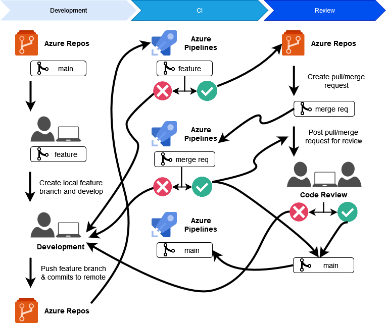

[[_TOC_]]

# Introduction

This document describes the branching strategies.

# Branching Strategy

## Choosing the right strategy

Multiple branching models were reviewed and most of them were eliminated based on advantages and disadvantages:

- Git Flow: too complicated, unreadable history, redundant branches, hard to control CI
- GitHub Flow: "simpler Git Flow", code reviews, short lived branches, doesn't solve releases
- GitLab Flow: more complicated then GitHub flow
- TBD(Trunk-Based Development): direct commits to main branch, no code reviews, best for small teams with high seniority
- STBD(Scaled Trunk-Based Development): short lived branches, code reviews, good for teams with varying seniority, releases(optional)

##Gitflow workflow

Gitflow workflow is used across all streams and below you can find more detailed information on working with branches and its naming convention. Any additional information can be found on [Gitflow Workflow](https://www.atlassian.com/git/tutorials/comparing-workflows/gitflow-workflow) page.

**Gitflow** is taken as a basis for the branching strategy. However, a few modifications are done in order to accommodate a support of multiple releases. For now as distribution model is not clear for the product, we assume that appropriate release branch will be used as a reference, than _**we should keep ALL release branches**_, create hotfixes from release/* instead of master). A decoupling of CI and CD processes via artifacts repository also affects the process. 

The workflow is great for a release-based software workflow.
Gitflow offers a dedicated channel for hotfixes to production.
 
The overall flow of Gitflow is:

- A **develop** branch is created from **main**.
- A **release** branch is created from **develop**.
- **Feature** branches are created from **develop**.
- When a **feature** is complete it is merged into the **develop** branch.
- When the work on the **release** branch is done it is merged into **develop** and **main**.
- If an issue in **main** is detected a **hotfix** branch is created from **main**
- Once the hotfix is complete it is merged to both **develop** and **main**.

###Pros and cons of Git Flow:
Pros:
- Git Flow is used by many distributed teams, including open source teams that have different skill levels. Project maintainers can perform code reviews and approve each line of code for releases.
- Git Flow works well for the "traditional release model," where releases are done once a month or once every couple of weeks.
- Git Flow also works well with an established product or multiple versions in production.

Cons:
- Git Flow can slow things down when you have to revise large pool reqs when you're trying to iterate quickly.
- Releases are hard to do more than once a week.
- Large features can take days to merge and resolve conflicts and force multiple test cycles.
- The project history in the git has a bunch of merge commits and makes it hard to see the actual work.
- Can be problematic in CI/CD scenarios.

##GitHub Flow
The main part of GitHub Flow - it is “Pull Request” or “PR”. Pull Requests are something that GitHub has created in their system that implements and supports Git. 
By doing this, they’ve added another couple steps in the middle of the Simplified Git Flow, to create what is called the GitHub Flow.

The above diagram lays out the Simplified Git Flow, with the purple elements added that represent the GitHub specific stuff that turns it into the GitHub Flow. The main steps remain the same, except there are some changes to how a team member, or developer, works in their Branch when working on a new feature for the project.

When working in a Branch, a Pull Request gets created. This Pull Request (PR) is a place within GitHub, outside of Git itself, where the team member(s) working a a feature/enhancement/bug fix can get feedback from other team members along the way. They can then use this feedback to make further changes and Commits to the Branch before ultimately testing and finally Merging their changes back up to the “master” Branch.

Actions of Github:
- Create a branch
- Make changes
- Create a pull request
- Address review comments
- Merge your pull request
- Delete your branch

###Pros and cons of GitHub Flow

Pros:
- Easier to understand and work with
- Time to live is minimal
- Fewer merges

Cons:
- Easier to break something in master branch and production server
- More expensive regression testing
- Competitive feature branches
- Not ready features

**Additional link**:
https://docs.github.com/en/get-started/quickstart/github-flow

##GitLab Flow
GitLab Flow is a simpler alternative to GitFlow that combines feature-driven development and feature branching with issue tracking.

With GitFlow, developers create a develop branch and make that the default while GitLab Flow works with the main branch right away.

GitLab Flow is great when you want to maintain multiple environments and when you prefer to have a staging environment separate from the production environment. Then, whenever the main branch is ready to be deployed, you can merge back into the production branch and release it.

Thus, this strategy offers proper isolation between environments allowing developers to maintain several versions of software in different environments.

While GitHub Flow assumes that you can deploy into production whenever you merge a feature branch into the master, GitLab Flow seeks to resolve that issue by allowing the code to pass through internal environments before it reaches production, as seen in the image below.

Therefore, this method is suited for situations where you don’t control the timing of the release, such as an iOS app that needs to go through the App store validation first or when you have specific deployment windows.

This approach is considered one of the best for projects where several versions for different platforms are constantly being developed.

###Pros and cons of GitLab Flow

Pros:
- Still looks pretty simple. 
- Control over what gets released
- Fewer merges than Git Flow

Cons:
- Potential rollbacks or release delays
- Lots of testing
- Competitive feature branches
- Not ready-to-use feature

**Additional link**: https://about.gitlab.com/blog/2023/07/27/gitlab-flow-duo/

##Trunk Based Development
*"A source-control branching model, where developers collaborate on code in a single branch called ‘trunk’* *, resist any pressure to create other long-lived development branches by employing documented techniques. They therefore avoid merge hell, do not break the build, and live happily ever after..."*

Key points:

- Short lived branches. With us, any branch that is created (except for the master) lives no more than two days. Two days and that's it, it's not Trunk anymore and everything is sad. Therefore, all branches, except for the master, for example, a release branch or for a feature, live no more than two days.
- Feature Flags and Branch By Abstraction.
- Continuous Code Review.
- a build server should be used to make sure that pushing new code doesn't break the build once it's added to the master branch, and to test code before merging from the short-lived feature branch back to the master branch.
- And the main idea is that now we have the master always ready for deployment, even if it has unfinished features. It is always release ready and it doesn't matter at all what's in it.

####Pros and cons of Trunk Based Development

Pros:

- Allows you to iterate quickly and still maintain quality.
- Works well in CI/CD scenarios.
- Can be released as often as possible, including several times a day.

Cons:

- Works best when you have a team of experienced developers.
- Half-finished features, improperly implemented feature flag's can cause problems.
- Initially may cause some problems if there is no good test coverage or confidence in system stability.

**Additional link**:
[https://trunkbaseddevelopment.com/](https://trunkbaseddevelopment.com)

### Scaled Trunk Based Development

This branching model uses short-lived `feature` branches with a life span of a few days before merging to the `trunk`(main/master/etc.), which is deployable at all times.

In Scaled Trunk Based Development, developers utilize short-lived feature branches, where an individual developer work on a very small piece of functionality. Once it is tested properly, the developer would raise a Pull Request to be integrated into the trunk ("main") branch. If the pull request validation is completed successfully and the reviewers are happy with the change, it is immediately merged into the trunk.

Release branches are cut from trunk at a point in time, some days ahead before the release is ready to be deployed to production. This branch is typically cut to harden the release, especially minor bug fixes etc. The key thing to be noted here is developers are not allowed to merge to release branches directly. They are only allowed to merge to trunk ("main") branch and cherry pick the changes to the respective release branch.

### Example of Automation of TBD

To get the most out of this branching strategy we need to have build automation for CI that validates code(& tests it):

- Whenever a developer pushes new branch/code CI should run for that branch until successful
- Opening a Pull request auto creates a PR build and runs CI
- After successful PR build the request should be posted for review
- When PR build and review is successful merge can happen
- Build master branch

Diagram to visualize above:

#Comparative Analysis

| Concern | Git flow |GitHub flow  |  Trunk based|
|--|--|--|--|
|Branching overhead|	significant|	lightweight|	lightweight|
|Deployment branch |	release|	feature|	main |
|Deployment trigger |	release cycle |	approved pull request|	merge to main
|Most stable branch |	main	| main |	main |
|Hotfixes via| 	hotfix branch|	feature branch|	main|
|Delivery cadence|	releases |	continuous	| continuous |
|Merge effort (merge hell)|	significant|	minimal|	minimal |
|Feedback timeline |	long and slow |	quick |	quick|
|Production issues|	rollback |	quick fix via feature branch|	feature toggles |
|Project Types|	enterprises |	open source, startups |	enterprises |

# Additional info

[Azure DevOps git branching guidance](https://learn.microsoft.com/en-us/azure/devops/repos/git/git-branching-guidance?view=azure-devops)

[What is the best Git branch strategy?](https://www.gitkraken.com/learn/git/best-practices/git-branch-strategy)
